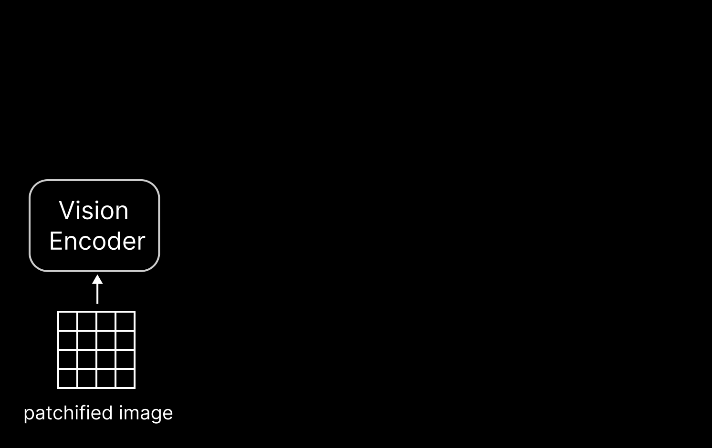
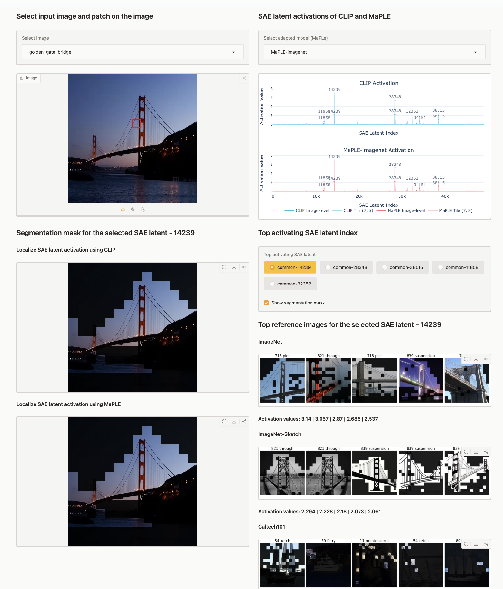

# PatchSAE: Sparse Autoencoders Reveal Selective Remapping of Visual Concepts During Adaptation

[](https://arxiv.org/abs/2412.05276)
[](https://openreview.net/forum?id=imT03YXlG2)
[](https://iclr.cc/virtual/2025/poster/28675)

> NOTE: Demo is currently down; work-in-progress
[](https://dynamical-inference.ai/patchsae/)
[](https://huggingface.co/spaces/dynamical-inference/patchsae-demo)

<div align="center">
    
</div>

## 🚀 Quick Navigation

- [Getting Started](#-getting-started)
- [Interactive Demo](#-interactive-demo)
- [Training & Analysis](#-patchsae-training-and-analysis)
- [Status Updates](#-status-updates)
- [License & Credits](#-license--credits)

## 🛠 Getting Started

Set up your environment with these simple steps:

```bash
# Create and activate environment
conda create --name patchsae python=3.12
conda activate patchsae

# Install dependencies
cd patchsae
pip install -r requirements.txt
```

When running any scripts, make sure to always set the `PYTHONPATH`. For example, to run the demo in `app.py`:

```bash
PYTHONPATH=./ python src/demo/app.py
```

## 🎮 Interactive Demo

### Online Demo on Hugging Face 🤗 [](https://dynamical-inference.ai/patchsae/)

Explore our pre-computed images and SAE latents without any installation!
> 💡 The demo may experience slowdowns due to network constraints. For optimal performance, consider disabling your VPN if you encounter any delays.


https://github.com/user-attachments/assets/0771a224-dd5b-485e-ba94-3b0b4f0150e1


<div align="center">
    
</div>


### Local Demo: Try Your Own Images

Want to experiment with your own images? Follow these steps:

#### 1. Setup Local Demo

First, download the necessary files:

- [out.zip](https://drive.google.com/file/d/1NJzF8PriKz_mopBY4l8_44R0FVi2uw2g/edit)
- [data.zip](https://drive.google.com/file/d/1reuDjXsiMkntf1JJPLC5a3CcWuJ6Ji3Z/edit)

You can download the files using `gdown` as follows:

> 💡 Need `gdown`? Install it with: `conda install conda-forge::gdown` or `pip install gdown`

```bash
# Activate environment
conda activate patchsae

# Download necessary files (35MB + 513MB)
gdown 1NJzF8PriKz_mopBY4l8_44R0FVi2uw2g  # out.zip
gdown 1reuDjXsiMkntf1JJPLC5a3CcWuJ6Ji3Z  # data.zip

# Extract files
unzip data.zip
unzip out.zip
```


Your folder structure should look like:

```
patchsae/
├── configs/
├── data/      # From data.zip
├── out/       # From out.zip
├── src/
│   └── demo/
│       └── app.py
├── tasks/
├── requirements.txt
└── ... (other files)
```

#### 2. Launch the Demo

```bash
PYTHONPATH=./ python src/demo/app.py
```

⚠️ **Note**:
- First run will download datasets from HuggingFace automatically (About 30GB in total)
- Demo runs on CPU by default
- Access the interface at http://127.0.0.1:7860 (or the URL shown in terminal)

## 📊 PatchSAE Training and Analysis

- **Training Instructions**: See [tasks/README.md](./tasks/README.md)
- **Analysis Notebooks**:
  - [demo.ipynb](./demo.ipynb)
  - [analysis.ipynb](./analysis/analysis.ipynb)

## 📝 Status Updates

- **Jan 13, 2025**: Training & Analysis code work properly. Minor error in data loading by class when using ImageNet.
- **Jan 09, 2025**: Analysis code works. Updated training with evaluation during training, fixed optimizer bug.
- **Jan 07, 2025**: Added analysis code. Reproducibility tests completed (trained on ImageNet, tested on Oxford-Flowers).
- **Jan 06, 2025**: Training code updated. Reproducibility testing in progress.
- **Jan 02, 2025**: Training code incomplete in this version. Updates coming soon.

## 📜 License & Credits

### Reference Implementations

- [SAE for ViT](https://github.com/HugoFry/mats_sae_training_for_ViTs)
- [SAELens](https://github.com/jbloomAus/SAELens)
- [Differentiable and Fast Geometric Median in NumPy and PyTorch](https://github.com/krishnap25/geom_median)
- [Self-regulating Prompts: Foundational Model Adaptation without Forgetting [ICCV 2023]](https://github.com/muzairkhattak/PromptSRC)
  - Used in: `configs/` and `msrc/models/`
- [MaPLe: Multi-modal Prompt Learning CVPR 2023](https://github.com/muzairkhattak/multimodal-prompt-learning)
  - Used in: `configs/models/maple/...yaml` and `data/clip/maple/imagenet/model.pth.tar-2`

### License Notice

Our code is distributed under an MIT license, please see the [LICENSE](LICENSE) file for details.
The [NOTICE](NOTICE) file lists license for all third-party code included in this repository.
Please include the contents of the LICENSE and NOTICE files in all re-distributions of this code.

---

### Citation

If you find our code or models useful in your work, please cite our [paper](https://arxiv.org/abs/2412.05276):

```
@inproceedings{
  lim2025patchsae,
  title={Sparse autoencoders reveal selective remapping of visual concepts during adaptation},
  author={Hyesu Lim and Jinho Choi and Jaegul Choo and Steffen Schneider},
  booktitle={The Thirteenth International Conference on Learning Representations},
  year={2025},
  url={https://openreview.net/forum?id=imT03YXlG2}
}
```
